# [DeepSeekSelfTool](https://github.com/ChinaRan0/DeepSeekSelfTool)

首个由DeepSeek独立开发的AI网络安全工具箱

首发公众号知攻善防实验室

## 目前功能

流量分析、JS代码审计、进程分析、HTTP转python、文本处理、正则表达式生成、WebShell检测、翻译

### 流量分析

调用的API接口，让AI分析流量。

意旨，粘贴数据包，让AI判断是否为恶意流量，方便安服、护网蓝队使用


恶意流量

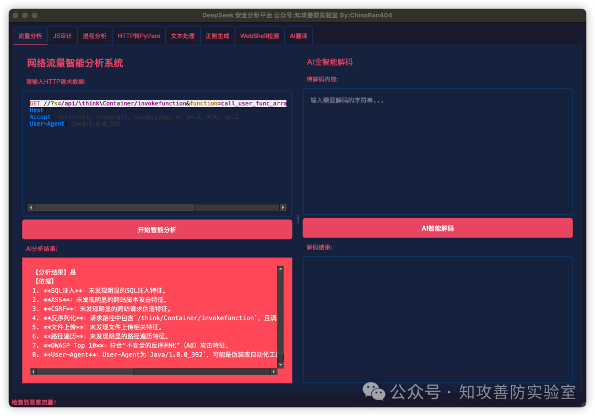

正常流量

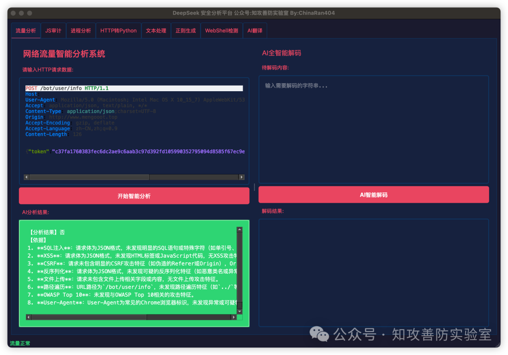

在流量分析中，经常需要解码以及日常需要解码的需求，可以直接加一个AI只能解码

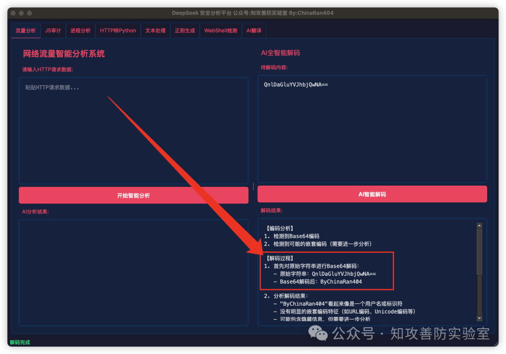

### JS代码审计

直接将关键的JavaScript代码粘贴进来，AI自动输出问题和风险点

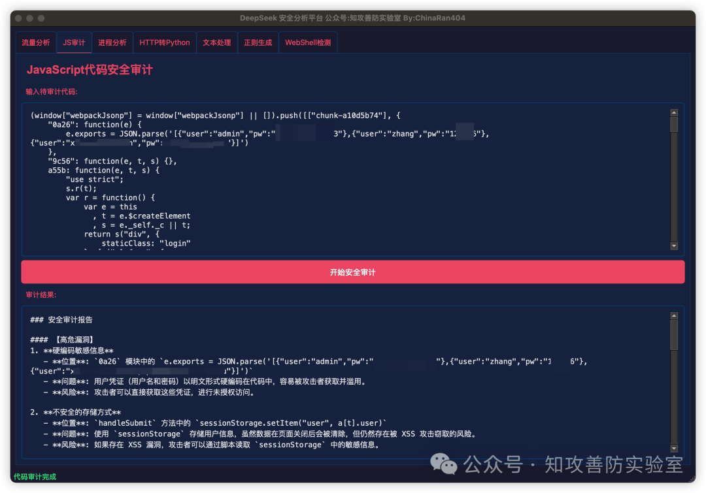

### 进程分析

粘贴Windows的tasklist或者Linux/macOS的ps aux，以显示所有进程，然后直接粘贴进来让AI去分析

可以用于

红队：杀软识别

蓝队：应急响应进程分析

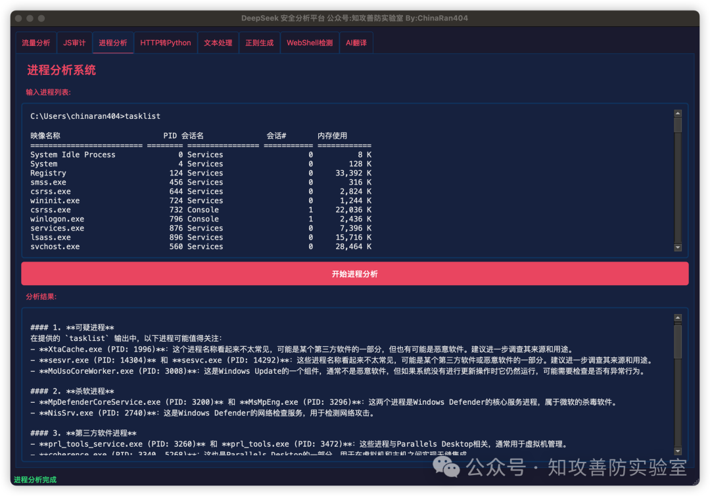

会把进程分为三类，可疑进程、杀软进程、第三方软件进程，并总结给你建议。

### HTTP转Python

有时候我们想写POC/EXP的时候，很多重复性的代码需要去写，这里不用了，直接把HTTP请求包粘贴进去，AI几秒钟就生成完成了

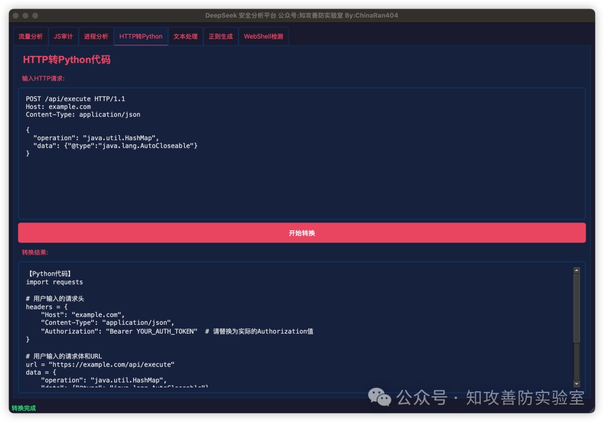

### 文本处理

有时候在处理一些文本的时候，例如资产测绘平台导出的数据要交给另外一个工具去调用，但是另外一个工具需要制定的格式，那么我们就可以输入少量的源文本和少量的样本格式，让AI写脚本，把源文本转换成样本格式

例如：

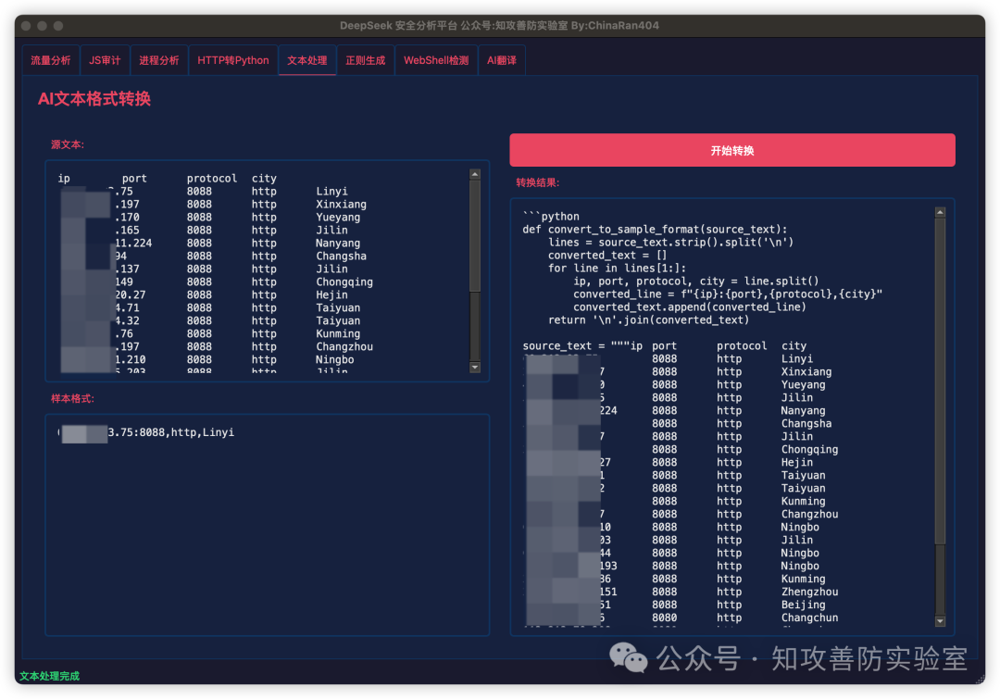

### 正则表达式生成

平时开发中最头疼的正则表达式，也是输入源文本和样本格式，AI直接给你正则表达式

例如在网页爬虫中

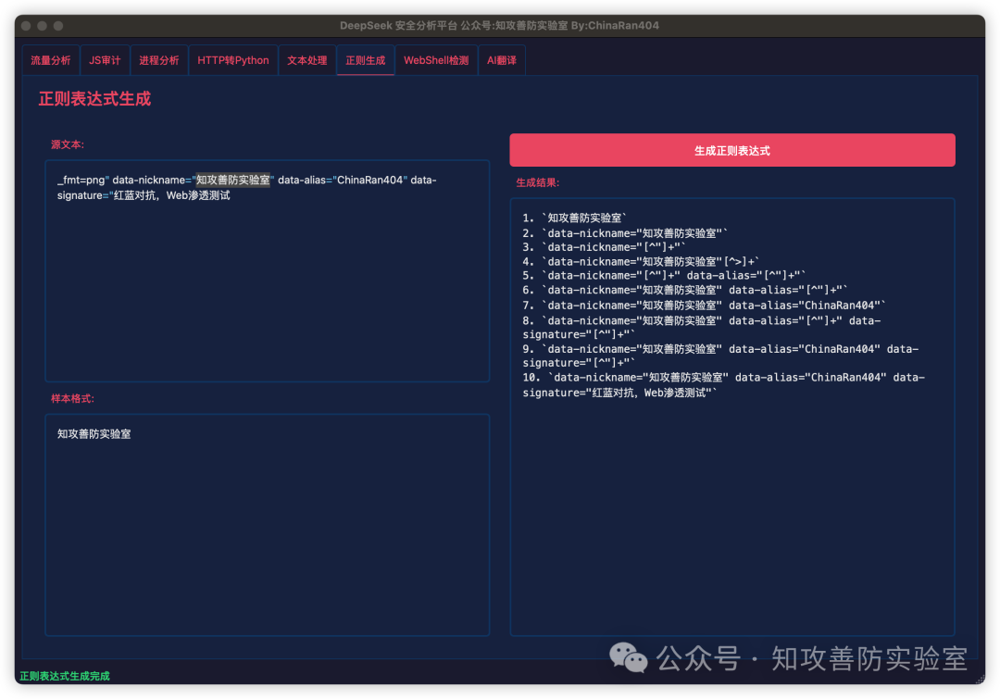

我输入源文本，这个文本可以是任何文本，我这里用的是HTML，然后我想匹配样本格式，AI就会给我很多正则表达式供我参考


### WebShell检测

AI检测WebShell的能力可太强了，强的可拍

他可以检测WebShell和内存马，Webshell直接给文件粘贴进去，内存马需要你人工dump出来。

恶意文件

这是以前文章一个大佬写的“原神免杀WebShell”的检测结果

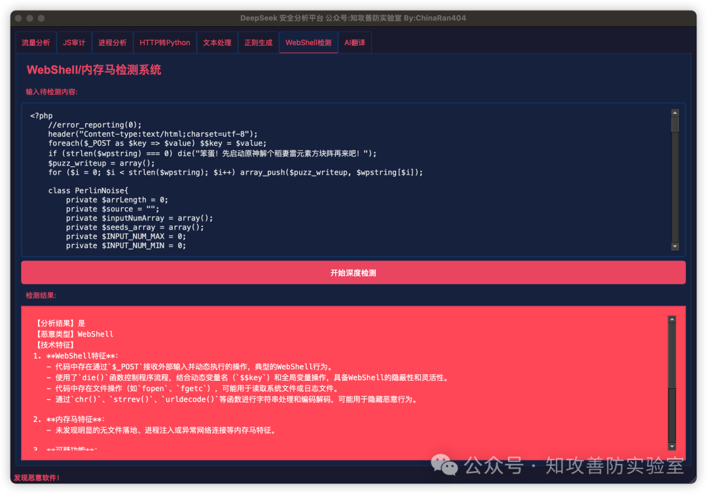

正常文件

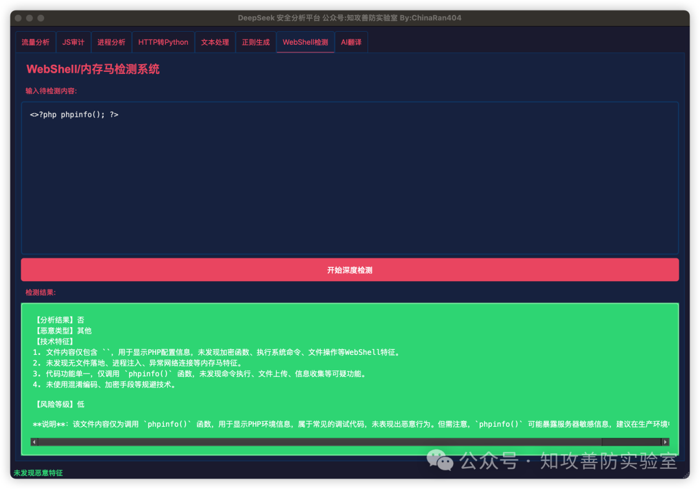

### AI翻译

以SQLmap为例子

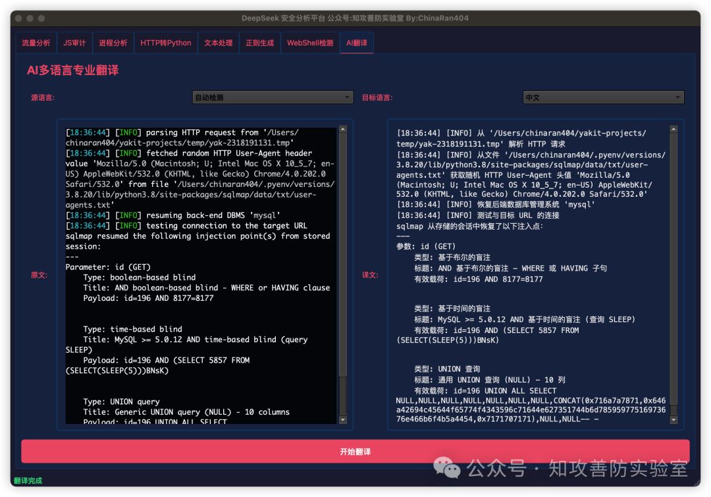

效果自己看，嘻嘻。


我随机抽取了4个php文件做测试，结果还挺好的，都审出来了。但是由于上下文的原因，不能夸文件进行审计，原理是逐个逐个将文件吐给AI，单丝对于我这种不会代码审计的，已经足够爽了。

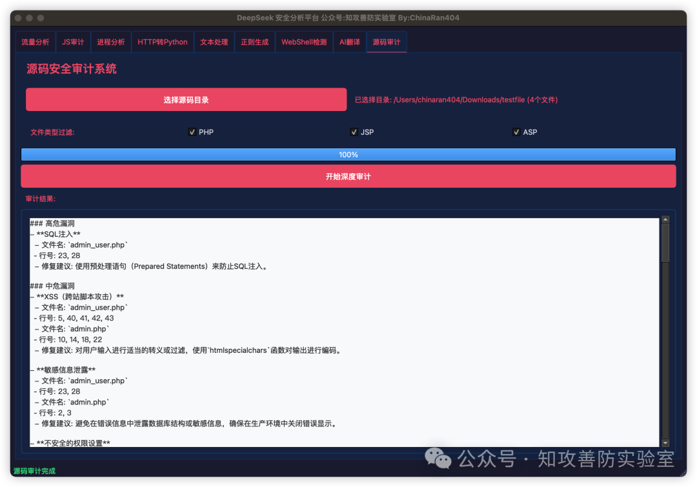

### 使用教程 

```python
git clone https://github.com/ChinaRan0/DeepSeekSelfTool
cd DeepSeekSelfTool
pip install -r requirements.txt
cp config.py.example config.py
配置config.py
python DeepSeekSelfTool.py
```


